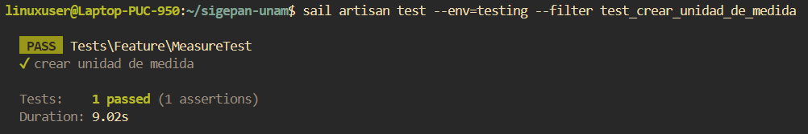
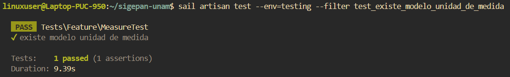
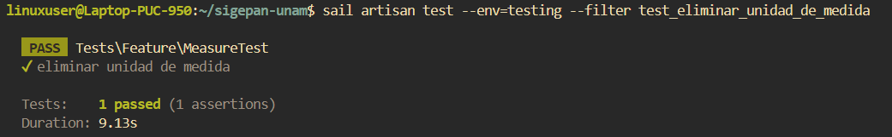
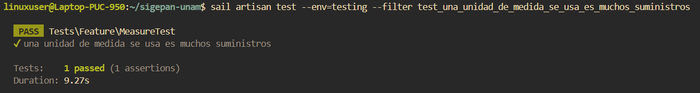
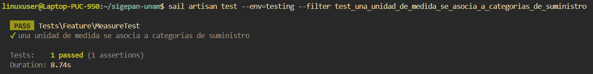

# Documentación de Tests: MeasureTest

## Información General
- **Archivo**: `/tests/Feature/MeasureTest.php`
- **Fecha de generación**: 2025-07-28 02:30:49
- **Total de tests**: 5

---

## TC001. - `test_crear_unidad_de_medida`

### 📋 Propósito del Test
Crear unidad de medida.

### 🎯 Resultado Esperado
Se crea una unidad de medida en el sistema.

### ⚙️ Configuración del Test
```php
// Método: test_crear_unidad_de_medida()
// Archivo: /tests/Feature/MeasureTest.php
// Línea: 34
```

### 📊 Resultado de Ejecución
**Estado**: Ejecutado.  
**Tiempo de ejecución**: 9.2s  
**Fecha de última ejecución**: 28/07/2025  

#### Captura de Pantalla


### 📝 Observaciones
Ninguna.

---

## TC002. - `test_existe_modelo_unidad_de_medida`

### 📋 Propósito del Test
Existe modelo unidad de medida.

### 🎯 Resultado Esperado
La instancia de Measure creada es en efecto una unidad de medida.

### ⚙️ Configuración del Test
```php
// Método: test_existe_modelo_unidad_de_medida()
// Archivo: /tests/Feature/MeasureTest.php
// Línea: 48
```

### 📊 Resultado de Ejecución
**Estado**: Ejecutado. 
**Tiempo de ejecución**: 9.3s 
**Fecha de última ejecución**: 28/07/2025  

#### Captura de Pantalla


### 📝 Observaciones
Ninguna.

---

## TC003. - `test_eliminar_unidad_de_medida`

### 📋 Propósito del Test
Eliminar unidad de medida.

### 🎯 Resultado Esperado
La unidad de medida es eliminada del sistema.

### ⚙️ Configuración del Test
```php
// Método: test_eliminar_unidad_de_medida()
// Archivo: /tests/Feature/MeasureTest.php
// Línea: 62
```

### 📊 Resultado de Ejecución
**Estado**: Ejecutado. 
**Tiempo de ejecución**: 9.13s 
**Fecha de última ejecución**: 28/07/2025  

#### Captura de Pantalla


### 📝 Observaciones
Ninguna.

---

## TC004. - `test_una_unidad_de_medida_se_usa_es_muchos_suministros`

### 📋 Propósito del Test
Una unidad de medida se usa en muchos suministros.

### 🎯 Resultado Esperado
La instancia de Measure creada puede relacionarse a uno o mas suministros.

### ⚙️ Configuración del Test
```php
// Método: test_una_unidad_de_medida_se_usa_es_muchos_suministros()
// Archivo: /tests/Feature/MeasureTest.php
// Línea: 78
```

### 📊 Resultado de Ejecución
**Estado**: Ejecutado.  
**Tiempo de ejecución**: 9.27s 
**Fecha de última ejecución**: 28/07/2025  

#### Captura de Pantalla


### 📝 Observaciones
Ninguna.

---

## TC005. - `test_una_unidad_de_medida_se_asocia_a_categorias_de_suministro`

### 📋 Propósito del Test
Una unidad de medida se usa en muchas categorias de suministros.

### 🎯 Resultado Esperado
La instancia de Measure creada puede relacionarse a uno o mas categorias de suministros.

### ⚙️ Configuración del Test
```php
// Método: test_una_unidad_de_medida_se_asocia_a_categorias_de_suministro()
// Archivo: /tests/Feature/MeasureTest.php
// Línea: 92
```

### 📊 Resultado de Ejecución
**Estado**: Ejecutado. 
**Tiempo de ejecución**: 8.7s  
**Fecha de última ejecución**: 28/07/2025 

#### Captura de Pantalla


### 📝 Observaciones
Ninguna.

---

## Resumen de Ejecución

### Estadísticas
- **Total de tests**: 5
- **Estado general**: Finalizado.
- **Última actualización**: 2025-07-28 02:30:49

---

**Documentación generada automáticamente con**: `php artisan test:document`  
**Fecha**: 2025-07-28 02:30:49  
**Versión de Laravel**: 11.22.0  
