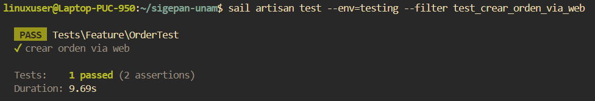
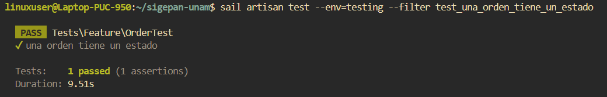
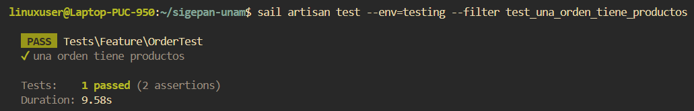
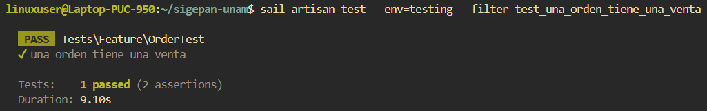

# Documentación de Tests: OrderTest

## Información General
- **Archivo**: `/tests/Feature/OrderTest.php`
- **Fecha de generación**: 2025-07-28 02:30:49
- **Total de tests**: 4

---

## TC001. - `test_crear_orden_via_web`

### 📋 Propósito del Test
Crear una orden (pedido) de productos a traves de la tienda web.

### 🎯 Resultado Esperado
Se crea una orden en el sistema.

### ⚙️ Configuración del Test
```php
// Método: test_crear_orden_via_web()
// Archivo: /tests/Feature/OrderTest.php
// Línea: 74
```

### 📊 Resultado de Ejecución
**Estado**: Ejecutado. 
**Tiempo de ejecución**: 9.6s 
**Fecha de última ejecución**: 28/07/25  

#### Captura de Pantalla


### 📝 Observaciones
Ninguna.

---

## TC002. - `test_una_orden_tiene_un_estado`

### 📋 Propósito del Test
Una orden tiene un estado de orden.

### 🎯 Resultado Esperado
Se verifica que una orden tiene un estado asociado.

### ⚙️ Configuración del Test
```php
// Método: test_una_orden_tiene_un_estado()
// Archivo: /tests/Feature/OrderTest.php
// Línea: 95
```

### 📊 Resultado de Ejecución
**Estado**: Ejecutado.  
**Tiempo de ejecución**: 9.5s  
**Fecha de última ejecución**: 28/07/2025  

#### Captura de Pantalla


### 📝 Observaciones
Ninguna.

---

## TC003. - `test_una_orden_tiene_productos`

### 📋 Propósito del Test
Una orden tiene productos asociados.

### 🎯 Resultado Esperado
Se verifica que una orden tiene un productos asociados.

### ⚙️ Configuración del Test
```php
// Método: test_una_orden_tiene_productos()
// Archivo: /tests/Feature/OrderTest.php
// Línea: 115
```

### 📊 Resultado de Ejecución
**Estado**: Ejecutado. 
**Tiempo de ejecución**: 9.5s  
**Fecha de última ejecución**: 28/07/2025 

#### Captura de Pantalla


### 📝 Observaciones
Ninguna.

---

## TC004. - `test_una_orden_tiene_una_venta`

### 📋 Propósito del Test
Una orden tiene una venta asociada.

### 🎯 Resultado Esperado
Se verifica que una orden tiene una venta asociada.

### ⚙️ Configuración del Test
```php
// Método: test_una_orden_tiene_una_venta()
// Archivo: /tests/Feature/OrderTest.php
// Línea: 151
```

### 📊 Resultado de Ejecución
**Estado**: Ejecutado.  
**Tiempo de ejecución**: 9.1s  
**Fecha de última ejecución**: 28/07/2025 

#### Captura de Pantalla


### 📝 Observaciones
Una orden podria no tener venta asociada si se cancela antes del pago.

---

## Resumen de Ejecución

### Estadísticas
- **Total de tests**: 4
- **Estado general**: Finalizado.
- **Última actualización**: 2025-07-28 02:30:49

---

**Documentación generada automáticamente con**: `php artisan test:document`  
**Fecha**: 2025-07-28 02:30:49  
**Versión de Laravel**: 11.22.0  
