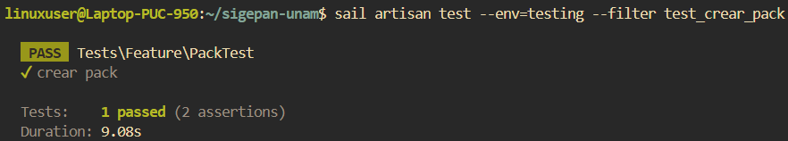
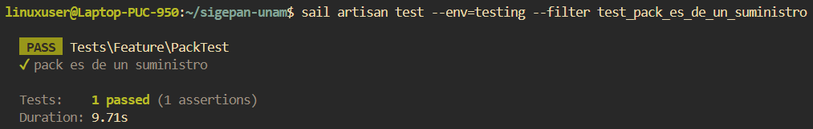
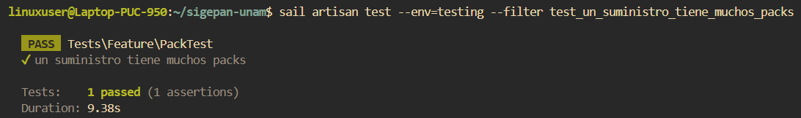
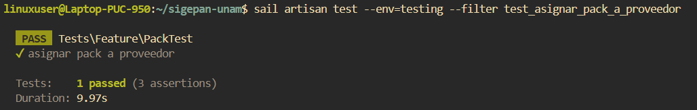

# Documentación de Tests: PackTest

## Información General
- **Archivo**: `/tests/Feature/PackTest.php`
- **Fecha de generación**: 2025-07-28 02:30:49
- **Total de tests**: 4

---

## TC001. - `test_crear_pack`

### 📋 Propósito del Test
Crear un pack suministro.

### 🎯 Resultado Esperado
Se crea un pack suministro en el sistema.

### ⚙️ Configuración del Test
```php
// Método: test_crear_pack()
// Archivo: /tests/Feature/PackTest.php
// Línea: 193
```

### 📊 Resultado de Ejecución
**Estado**: Ejecutado 
**Tiempo de ejecución**: 9s 
**Fecha de última ejecución**: 28/07/2025

#### Captura de Pantalla


### 📝 Observaciones
Necesita una categoria, suministro, unidad de medida, marca y tipo de suministro.

---

## TC002. - `test_pack_es_de_un_suministro`

### 📋 Propósito del Test
Un pack pertenece a un suministro.

### 🎯 Resultado Esperado
Se verifica que un pack pertenece a un suministro en el sistema.

### ⚙️ Configuración del Test
```php
// Método: test_pack_es_de_un_suministro()
// Archivo: /tests/Feature/PackTest.php
// Línea: 214
```

### 📊 Resultado de Ejecución
**Estado**: Ejecutado  
**Tiempo de ejecución**: 9.7s  
**Fecha de última ejecución**: 28/07/2025  

#### Captura de Pantalla


### 📝 Observaciones
Ninguna.

---

## TC003. - `test_un_suministro_tiene_muchos_packs`

### 📋 Propósito del Test
Un suministro tiene muchos packs.

### 🎯 Resultado Esperado
Se verifica que un suministro tiene muchos packs en el sistema.

### ⚙️ Configuración del Test
```php
// Método: test_un_suministro_tiene_muchos_packs()
// Archivo: /tests/Feature/PackTest.php
// Línea: 234
```

### 📊 Resultado de Ejecución
**Estado**: Ejecutado  
**Tiempo de ejecución**: 9.3s 
**Fecha de última ejecución**: 28/07/2025

#### Captura de Pantalla


### 📝 Observaciones
Ninguna.

---

## TC004. - `test_asignar_pack_a_proveedor`

### 📋 Propósito del Test
Un pack pertenece a un proveedor.

### 🎯 Resultado Esperado
Se verifica que un pack pertenece a un proveedor, mediante un precio, en el sistema.

### ⚙️ Configuración del Test
```php
// Método: test_asignar_pack_a_proveedor()
// Archivo: /tests/Feature/PackTest.php
// Línea: 254
```

### 📊 Resultado de Ejecución
**Estado**: Ejecutado.  
**Tiempo de ejecución**: 9.9s 
**Fecha de última ejecución**: 28/07/2025  

#### Captura de Pantalla


### 📝 Observaciones
Ninguna.

---

## Resumen de Ejecución

### Estadísticas
- **Total de tests**: 4
- **Estado general**: Finalizado.
- **Última actualización**: 2025-07-28 02:30:49

---

**Documentación generada automáticamente con**: `php artisan test:document`  
**Fecha**: 2025-07-28 02:30:49  
**Versión de Laravel**: 11.22.0  
