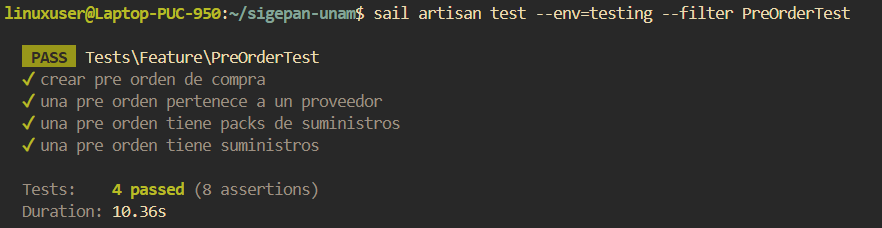

# Documentación de Tests: PreOrderTest

## Información General
- **Archivo**: `/tests/Feature/PreOrderTest.php`
- **Fecha de generación**: 2025-07-28 02:30:49
- **Total de tests**: 4

---

## TC001. - `test_crear_pre_orden_de_compra`

### 📋 Propósito del Test
Crear una preorden.

### 🎯 Resultado Esperado
Se crea una preorden en el sistema.

### ⚙️ Configuración del Test
```php
// Método: test_crear_pre_orden_de_compra()
// Archivo: /tests/Feature/PreOrderTest.php
// Línea: 200
```

### 📊 Resultado de Ejecución
**Estado**: Ejecutado.

### 📝 Observaciones
Ninguna.

---

## TC002. - `test_una_pre_orden_pertenece_a_un_proveedor`

### 📋 Propósito del Test
Una preorden se asocia a un proveedor.

### 🎯 Resultado Esperado
Se crea una preorden en el sistema asociada a un proveedor.

### ⚙️ Configuración del Test
```php
// Método: test_una_pre_orden_pertenece_a_un_proveedor()
// Archivo: /tests/Feature/PreOrderTest.php
// Línea: 231
```

### 📊 Resultado de Ejecución
**Estado**: Ejecutado

### 📝 Observaciones
Ninguna.

---

## TC003. - `test_una_pre_orden_tiene_packs_de_suministros`

### 📋 Propósito del Test
Una preorden se asocia a packs de suministros.

### 🎯 Resultado Esperado
Se crea una preorden en el sistema asociada a un pack de suministros.

### ⚙️ Configuración del Test
```php
// Método: test_una_pre_orden_tiene_packs_de_suministros()
// Archivo: /tests/Feature/PreOrderTest.php
// Línea: 262
```

### 📊 Resultado de Ejecución
**Estado**: Ejecutado

### 📝 Observaciones
Ninguna.

---

## TC004. - `test_una_pre_orden_tiene_suministros`

### 📋 Propósito del Test
Una preorden se asocia a suministros.

### 🎯 Resultado Esperado
Se crea una preorden en el sistema asociada a un suministro.

### ⚙️ Configuración del Test
```php
// Método: test_una_pre_orden_tiene_suministros()
// Archivo: /tests/Feature/PreOrderTest.php
// Línea: 314
```

### 📊 Resultado de Ejecución
**Estado**: Ejecutado

### 📝 Observaciones
Ninguna.

---

## Resumen de Ejecución

### Estadísticas
- **Total de tests**: 4
- **Estado general**: Finalizado
- **Última actualización**: 2025-07-28 02:30:49

#### Captura de Pantalla


---

**Documentación generada automáticamente con**: `php artisan test:document`  
**Fecha**: 2025-07-28 02:30:49  
**Versión de Laravel**: 11.22.0  
