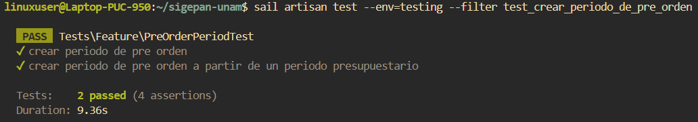
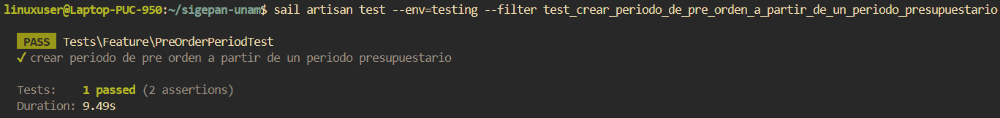
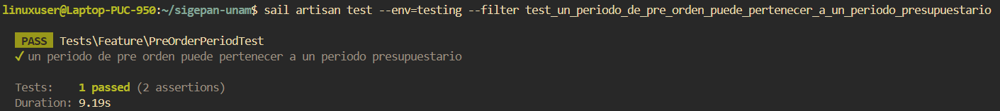
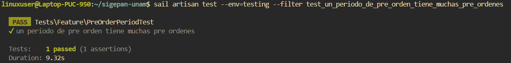

# Documentación de Tests: PreOrderPeriodTest

## Información General
- **Archivo**: `/tests/Feature/PreOrderPeriodTest.php`
- **Fecha de generación**: 2025-07-28 02:30:49
- **Total de tests**: 4

---

## TC001. - `test_crear_periodo_de_pre_orden`

### 📋 Propósito del Test
Crear un periodo de preorden.

### 🎯 Resultado Esperado
Se crea un periodo de preordenes en el sistema.

### ⚙️ Configuración del Test
```php
// Método: test_crear_periodo_de_pre_orden()
// Archivo: /tests/Feature/PreOrderPeriodTest.php
// Línea: 58
```

### 📊 Resultado de Ejecución
**Estado**: Ejecutado  
**Tiempo de ejecución**: 9.3s  
**Fecha de última ejecución**: 28/07/2025  

#### Captura de Pantalla


### 📝 Observaciones
Sin periodo presupuestario previo.

---

## TC002. - `test_crear_periodo_de_pre_orden_a_partir_de_un_periodo_presupuestario`

### 📋 Propósito del Test
Crear un periodo de preorden con periodo presupuestario previo.

### 🎯 Resultado Esperado
Se crea un periodo de preordenes en el sistema.

### ⚙️ Configuración del Test
```php
// Método: test_crear_periodo_de_pre_orden_a_partir_de_un_periodo_presupuestario()
// Archivo: /tests/Feature/PreOrderPeriodTest.php
// Línea: 76
```

### 📊 Resultado de Ejecución
**Estado**: Ejecutado.  
**Tiempo de ejecución**: 9.4s  
**Fecha de última ejecución**: 28/07/25  

#### Captura de Pantalla


### 📝 Observaciones
Asociado a un periodo presupuestario previo.

---

## TC003. - `test_un_periodo_de_pre_orden_puede_pertenecer_a_un_periodo_presupuestario`

### 📋 Propósito del Test
Un periodo de preorden tiene un periodo presupuestario asociado.

### 🎯 Resultado Esperado
Se verifica que un periodo de preordenes tiene relacion con un periodo presupuestario en el sistema.

### ⚙️ Configuración del Test
```php
// Método: test_un_periodo_de_pre_orden_puede_pertenecer_a_un_periodo_presupuestario()
// Archivo: /tests/Feature/PreOrderPeriodTest.php
// Línea: 99
```

### 📊 Resultado de Ejecución
**Estado**: Ejecutado  
**Tiempo de ejecución**: 9.1s  
**Fecha de última ejecución**: 28/07/2025  

#### Captura de Pantalla


### 📝 Observaciones
Ninguna.

---

## TC004. - `test_un_periodo_de_pre_orden_tiene_muchas_pre_ordenes`

### 📋 Propósito del Test
Un periodo de preorden tiene preordenes asociadas.

### 🎯 Resultado Esperado
Se verifica que un periodo de preordenes tiene relacion con preordenes en el sistema.

### ⚙️ Configuración del Test
```php
// Método: test_un_periodo_de_pre_orden_tiene_muchas_pre_ordenes()
// Archivo: /tests/Feature/PreOrderPeriodTest.php
// Línea: 117
```

### 📊 Resultado de Ejecución
**Estado**: ⏳ Pendiente de ejecución  
**Tiempo de ejecución**: 9.3s  
**Fecha de última ejecución**: 28/07/2025  

#### Captura de Pantalla


### 📝 Observaciones
Ninguna.

---

## Resumen de Ejecución

### Estadísticas
- **Total de tests**: 4
- **Estado general**: Finalizado
- **Última actualización**: 2025-07-28 02:30:49

---

**Documentación generada automáticamente con**: `php artisan test:document`  
**Fecha**: 2025-07-28 02:30:49  
**Versión de Laravel**: 11.22.0  
