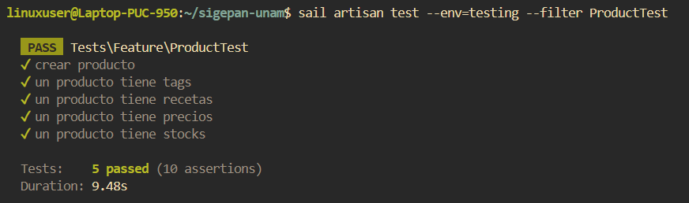

# Documentación de Tests: ProductTest

## Información General
- **Archivo**: `/tests/Feature/ProductTest.php`
- **Fecha de generación**: 2025-07-28 02:30:49
- **Total de tests**: 5

---

## TC001. - `test_crear_producto`

### 📋 Propósito del Test
Crear un producto.

### 🎯 Resultado Esperado
Se crea un producto en el sistema.

### ⚙️ Configuración del Test
```php
// Método: test_crear_producto()
// Archivo: /tests/Feature/ProductTest.php
// Línea: 63
```

### 📊 Resultado de Ejecución
**Estado**: Ejecutado

### 📝 Observaciones
Ninguna.

---

## TC002. - `test_un_producto_tiene_tags`

### 📋 Propósito del Test
Un producto tiene varias etiquetas de clasificacion.

### 🎯 Resultado Esperado
Se verifica que el producto tiene etiquetas de clasificacion.

### ⚙️ Configuración del Test
```php
// Método: test_un_producto_tiene_tags()
// Archivo: /tests/Feature/ProductTest.php
// Línea: 78
```

### 📊 Resultado de Ejecución
**Estado**: Ejecutado

### 📝 Observaciones
Ninguna.

---

## TC003. - `test_un_producto_tiene_recetas`

### 📋 Propósito del Test
Un producto tiene varias recetas.

### 🎯 Resultado Esperado
Se verifica que el producto tiene recetas asociadas.

### ⚙️ Configuración del Test
```php
// Método: test_un_producto_tiene_recetas()
// Archivo: /tests/Feature/ProductTest.php
// Línea: 96
```

### 📊 Resultado de Ejecución
**Estado**: Ejecutado

### 📝 Observaciones
Una o mas recetas.

---

## TC004. - `test_un_producto_tiene_precios`

### 📋 Propósito del Test
Un producto tiene varios precios.

### 🎯 Resultado Esperado
Se verifica que el producto tiene precios asociadas.

### ⚙️ Configuración del Test
```php
// Método: test_un_producto_tiene_precios()
// Archivo: /tests/Feature/ProductTest.php
// Línea: 114
```

### 📊 Resultado de Ejecución
**Estado**: Ejecutado

### 📝 Observaciones
Una o mas precios.

---

## TC005. - `test_un_producto_tiene_stocks`

### 📋 Propósito del Test
Un producto tiene varios stocks.

### 🎯 Resultado Esperado
Se verifica que el producto tiene varios stocks asociados.

### ⚙️ Configuración del Test
```php
// Método: test_un_producto_tiene_stocks()
// Archivo: /tests/Feature/ProductTest.php
// Línea: 132
```

### 📊 Resultado de Ejecución
**Estado**: Ejecutado

### 📝 Observaciones
Una o mas lotes de stock.

---

## Resumen de Ejecución

### Estadísticas
- **Total de tests**: 5
- **Estado general**: ⏳ Pendiente
- **Última actualización**: 2025-07-28 02:30:49

#### Captura de Pantalla


---

**Documentación generada automáticamente con**: `php artisan test:document`  
**Fecha**: 2025-07-28 02:30:49  
**Versión de Laravel**: 11.22.0  
