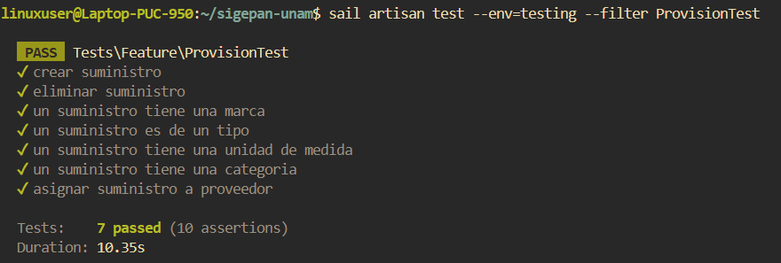

# Documentación de Tests: ProvisionTest

## Información General
- **Archivo**: `/tests/Feature/ProvisionTest.php`
- **Fecha de generación**: 2025-07-28 02:30:49
- **Total de tests**: 7

---

## TC001. - `test_crear_suministro`

### 📋 Propósito del Test
Crear un suministro.

### 🎯 Resultado Esperado
Se crea un suministro en el sistema.

### ⚙️ Configuración del Test
```php
// Método: test_crear_suministro()
// Archivo: /tests/Feature/ProvisionTest.php
// Línea: 159
```

### 📊 Resultado de Ejecución
**Estado**: Ejecutado

### 📝 Observaciones
Necesita una categoria, unidad de medida, marca y tipo de suministro.

---

## TC002. - `test_eliminar_suministro`

### 📋 Propósito del Test
Elimiar un suministro.

### 🎯 Resultado Esperado
Se elimina un suministro en el sistema.

### ⚙️ Configuración del Test
```php
// Método: test_eliminar_suministro()
// Archivo: /tests/Feature/ProvisionTest.php
// Línea: 178
```

### 📊 Resultado de Ejecución
**Estado**: Ejecutado

### 📝 Observaciones
Ninguna.

---

## TC003. - `test_un_suministro_tiene_una_marca`

### 📋 Propósito del Test
Asignar marca un suministro.

### 🎯 Resultado Esperado
Se asigna una marca a un suministro en el sistema.

### ⚙️ Configuración del Test
```php
// Método: test_un_suministro_tiene_una_marca()
// Archivo: /tests/Feature/ProvisionTest.php
// Línea: 198
```

### 📊 Resultado de Ejecución
**Estado**: Ejecutado

### 📝 Observaciones
Ninguna.

---

## TC004. - `test_un_suministro_es_de_un_tipo`

### 📋 Propósito del Test
Asignar un tipo a un suministro.

### 🎯 Resultado Esperado
Se asigna un tipo de suministro a un suministro en el sistema.

### ⚙️ Configuración del Test
```php
// Método: test_un_suministro_es_de_un_tipo()
// Archivo: /tests/Feature/ProvisionTest.php
// Línea: 218
```

### 📊 Resultado de Ejecución
**Estado**: Ejecutado

### 📝 Observaciones
Ninguna.

---

## TC005. - `test_un_suministro_tiene_una_unidad_de_medida`

### 📋 Propósito del Test
Asignar una unidad de medida a un suministro.

### 🎯 Resultado Esperado
Se asigna una unidad de medida a un suministro en el sistema.

### ⚙️ Configuración del Test
```php
// Método: test_un_suministro_tiene_una_unidad_de_medida()
// Archivo: /tests/Feature/ProvisionTest.php
// Línea: 236
```

### 📊 Resultado de Ejecución
**Estado**: Ejecutado

### 📝 Observaciones
Ninguna.

---

## TC006. - `test_un_suministro_tiene_una_categoria`

### 📋 Propósito del Test
Asignar una categoria de suministro a un suministro.

### 🎯 Resultado Esperado
Se asigna una categoria de suministro a un suministro en el sistema.

### ⚙️ Configuración del Test
```php
// Método: test_un_suministro_tiene_una_categoria()
// Archivo: /tests/Feature/ProvisionTest.php
// Línea: 254
```

### 📊 Resultado de Ejecución
**Estado**: Ejecutado

### 📝 Observaciones
Ninguna.

---

## TC006. - `test_asignar_suministro_a_proveedor`

### 📋 Propósito del Test
Asignar un proveedor con un precio para un suministro.

### 🎯 Resultado Esperado
Se asigna un proveedor a un suministro mediante un precio en el sistema.

### ⚙️ Configuración del Test
```php
// Método: test_asignar_suministro_a_proveedor()
// Archivo: /tests/Feature/ProvisionTest.php
// Línea: 272
```

### 📊 Resultado de Ejecución
**Estado**: Ejecutado

### 📝 Observaciones
Ninguna.

---

## Resumen de Ejecución

### Estadísticas
- **Total de tests**: 7
- **Estado general**: Finalizado
- **Última actualización**: 2025-07-28 02:30:49

#### Captura de Pantalla


---

**Documentación generada automáticamente con**: `php artisan test:document`  
**Fecha**: 2025-07-28 02:30:49  
**Versión de Laravel**: 11.22.0  
