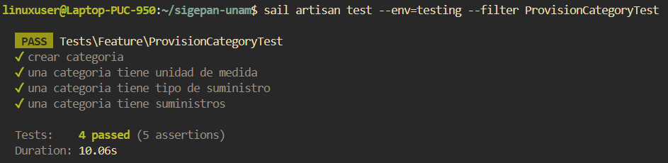

# Documentación de Tests: ProvisionCategoryTest

## Información General
- **Archivo**: `/tests/Feature/ProvisionCategoryTest.php`
- **Fecha de generación**: 2025-07-28 02:30:49
- **Total de tests**: 4

---

## TC001. - `test_crear_categoria`

### 📋 Propósito del Test
Crear una categoria de suministro.

### 🎯 Resultado Esperado
Se crea una categoria de suministro en el sistema.

### ⚙️ Configuración del Test
```php
// Método: test_crear_categoria()
// Archivo: /tests/Feature/ProvisionCategoryTest.php
// Línea: 62
```

### 📊 Resultado de Ejecución
**Estado**: Ejecutado

### 📝 Observaciones
Necesita una unidad de medida, y tipo de suministro.

---

## TC002. - `test_una_categoria_tiene_unidad_de_medida`

### 📋 Propósito del Test
Una categoria tiene unidad de medida.

### 🎯 Resultado Esperado
Se verifica que una categoria de suministro tiene unidad de medida en el sistema.

### ⚙️ Configuración del Test
```php
// Método: test_una_categoria_tiene_unidad_de_medida()
// Archivo: /tests/Feature/ProvisionCategoryTest.php
// Línea: 77
```

### 📊 Resultado de Ejecución
**Estado**: Ejecutado

### 📝 Observaciones
Necesita una unidad de medida, y tipo de suministro.

---

## TC003. - `test_una_categoria_tiene_tipo_de_suministro`

### 📋 Propósito del Test
Una categoria tiene tipo de suministro.

### 🎯 Resultado Esperado
Se verifica que una categoria de suministro tiene tipo de suministro en el sistema.

### ⚙️ Configuración del Test
```php
// Método: test_una_categoria_tiene_tipo_de_suministro()
// Archivo: /tests/Feature/ProvisionCategoryTest.php
// Línea: 91
```

### 📊 Resultado de Ejecución
**Estado**: Ejecutado

### 📝 Observaciones
Ninguna.

---

## TC004. - `test_una_categoria_tiene_suministros`

### 📋 Propósito del Test
Una categoria tiene muchos suministros.

### 🎯 Resultado Esperado
Se verifica que una categoria de suministro tiene muchos suministros en el sistema.

### ⚙️ Configuración del Test
```php
// Método: test_una_categoria_tiene_suministros()
// Archivo: /tests/Feature/ProvisionCategoryTest.php
// Línea: 105
```

### 📊 Resultado de Ejecución
**Estado**: Ejecutado

### 📝 Observaciones
Ninguna.

---

## Resumen de Ejecución

### Estadísticas
- **Total de tests**: 4
- **Estado general**: Finalizado
- **Última actualización**: 2025-07-28 02:30:49

#### Captura de Pantalla


---

**Documentación generada automáticamente con**: `php artisan test:document`  
**Fecha**: 2025-07-28 02:30:49  
**Versión de Laravel**: 11.22.0  
