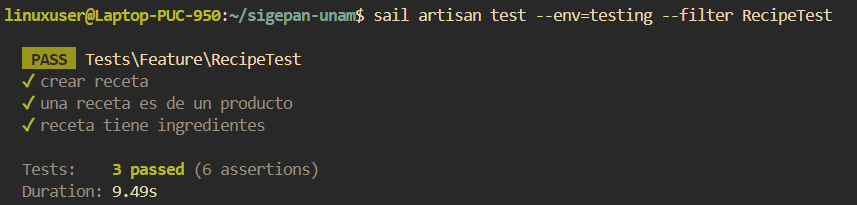

# Documentación de Tests: RecipeTest

## Información General
- **Archivo**: `/tests/Feature/RecipeTest.php`
- **Fecha de generación**: 2025-07-28 02:30:49
- **Total de tests**: 3

---

## TC001. - `test_crear_receta`

### 📋 Propósito del Test
Crear una receta.

### 🎯 Resultado Esperado
Se crea una receta en el sistema.

### ⚙️ Configuración del Test
```php
// Método: test_crear_receta()
// Archivo: /tests/Feature/RecipeTest.php
// Línea: 63
```

### 📊 Resultado de Ejecución
**Estado**: Ejecutado

### 📝 Observaciones
Ninguna.

---

## TC002. - `test_una_receta_es_de_un_producto`

### 📋 Propósito del Test
Una receta es de un producto.

### 🎯 Resultado Esperado
Se verifica que una receta es de un producto.

### ⚙️ Configuración del Test
```php
// Método: test_una_receta_es_de_un_producto()
// Archivo: /tests/Feature/RecipeTest.php
// Línea: 81
```

### 📊 Resultado de Ejecución
**Estado**: Ejecutado

### 📝 Observaciones
Ninguna.

---

## TC003. - `test_receta_tiene_ingredientes`

### 📋 Propósito del Test
Una receta tiene ingredientes (categorias de suministros) asociados.

### 🎯 Resultado Esperado
Se verifica que una receta tiene ingredientes con cantidades.

### ⚙️ Configuración del Test
```php
// Método: test_receta_tiene_ingredientes()
// Archivo: /tests/Feature/RecipeTest.php
// Línea: 99
```

### 📊 Resultado de Ejecución
**Estado**: Ejecutado

### 📝 Observaciones
Necesita una categoria, unidad de medida y tipo de suministro.

---

## Resumen de Ejecución

### Estadísticas
- **Total de tests**: 3
- **Estado general**: Finalizado
- **Última actualización**: 2025-07-28 02:30:49

#### Captura de Pantalla


---

**Documentación generada automáticamente con**: `php artisan test:document`  
**Fecha**: 2025-07-28 02:30:49  
**Versión de Laravel**: 11.22.0  
