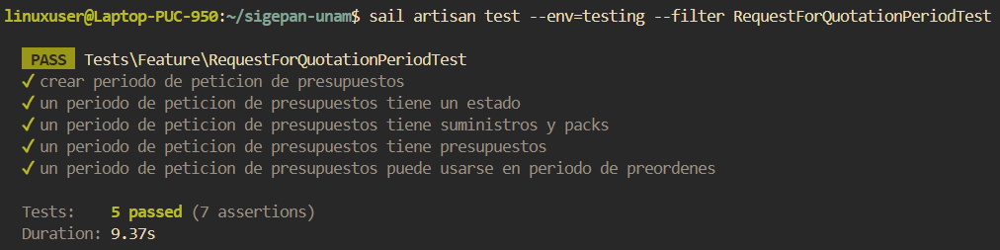

# Documentación de Tests: RequestForQuotationPeriodTest

## Información General
- **Archivo**: `/tests/Feature/RequestForQuotationPeriodTest.php`
- **Fecha de generación**: 2025-07-28 02:30:49
- **Total de tests**: 5

---

## TC001. - `test_crear_periodo_de_peticion_de_presupuestos`

### 📋 Propósito del Test
Crear un periodo de peticion de presupuestos.

### 🎯 Resultado Esperado
Se crea un periodo de peticion de presupuestos en el sistema.

### ⚙️ Configuración del Test
```php
// Método: test_crear_periodo_de_peticion_de_presupuestos()
// Archivo: /tests/Feature/RequestForQuotationPeriodTest.php
// Línea: 39
```

### 📊 Resultado de Ejecución
**Estado**: Ejecutado

### 📝 Observaciones
Ninguna.

---

## TC002. - `test_un_periodo_de_peticion_de_presupuestos_tiene_un_estado`

### 📋 Propósito del Test
Un periodo de peticion de presupuestos tiene un estado.

### 🎯 Resultado Esperado
Se verifica que un periodo de peticion de presupuestos tiene un estado en el sistema.

### ⚙️ Configuración del Test
```php
// Método: test_un_periodo_de_peticion_de_presupuestos_tiene_un_estado()
// Archivo: /tests/Feature/RequestForQuotationPeriodTest.php
// Línea: 58
```

### 📊 Resultado de Ejecución
**Estado**: Ejecutado

### 📝 Observaciones
Ninguna.

---

## TC003. - `test_un_periodo_de_peticion_de_presupuestos_tiene_suministros_y_packs`

### 📋 Propósito del Test
Un periodo de peticion de presupuestos tiene suministros y packs.

### 🎯 Resultado Esperado
Se verifica que un periodo de peticion de presupuestos tiene suministros y packs en el sistema.

### ⚙️ Configuración del Test
```php
// Método: test_un_periodo_de_peticion_de_presupuestos_tiene_suministros_y_packs()
// Archivo: /tests/Feature/RequestForQuotationPeriodTest.php
// Línea: 75
```

### 📊 Resultado de Ejecución
**Estado**: Ejecutado

### 📝 Observaciones
Ninguna.

---

## TC004. - `test_un_periodo_de_peticion_de_presupuestos_tiene_presupuestos`

### 📋 Propósito del Test
Un periodo de peticion de presupuestos tiene presupuestos asociados.

### 🎯 Resultado Esperado
Se verifica que un periodo de peticion de presupuestos tiene presupuestos en el sistema.

### ⚙️ Configuración del Test
```php
// Método: test_un_periodo_de_peticion_de_presupuestos_tiene_presupuestos()
// Archivo: /tests/Feature/RequestForQuotationPeriodTest.php
// Línea: 93
```

### 📊 Resultado de Ejecución
**Estado**: Ejecutado

### 📝 Observaciones
Ninguna.

---

## TC005. - `test_un_periodo_de_peticion_de_presupuestos_puede_usarse_en_periodo_de_preordenes`

### 📋 Propósito del Test
Un periodo de peticion de presupuestos puede usarse como partida para un periodo de pre ordenes de compra.

### 🎯 Resultado Esperado
Se verifica que un periodo de peticion de presupuestos puede usarse como partida para un periodo de pre ordenes de compra en el sistema.

### ⚙️ Configuración del Test
```php
// Método: test_un_periodo_de_peticion_de_presupuestos_puede_usarse_en_periodo_de_preordenes()
// Archivo: /tests/Feature/RequestForQuotationPeriodTest.php
// Línea: 110
```

### 📊 Resultado de Ejecución
**Estado**: Ejecutado

### 📝 Observaciones
Ninguna.

---

## Resumen de Ejecución

### Estadísticas
- **Total de tests**: 5
- **Estado general**: Finalizado
- **Última actualización**: 2025-07-28 02:30:49

#### Captura de Pantalla


---

**Documentación generada automáticamente con**: `php artisan test:document`  
**Fecha**: 2025-07-28 02:30:49  
**Versión de Laravel**: 11.22.0  
