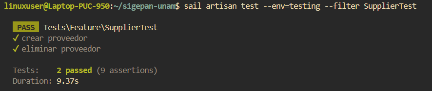

# Documentación de Tests: SupplierTest

## Información General
- **Archivo**: `/tests/Feature/SupplierTest.php`
- **Fecha de generación**: 2025-07-28 02:30:49
- **Total de tests**: 2

---

## TC001. - `test_crear_proveedor`

### 📋 Propósito del Test
Crear un proveedor.

### 🎯 Resultado Esperado
Se crea un proveedor en el sistema.

### ⚙️ Configuración del Test
```php
// Método: test_crear_proveedor()
// Archivo: /tests/Feature/SupplierTest.php
// Línea: 47
```

### 📊 Resultado de Ejecución
**Estado**: Ejecutado

### 📝 Observaciones
Ninguna.

---

## TC002. - `test_eliminar_proveedor`

### 📋 Propósito del Test
Eliminar un proveedor.

### 🎯 Resultado Esperado
Se elimina un proveedor en el sistema.

### ⚙️ Configuración del Test
```php
// Método: test_eliminar_proveedor()
// Archivo: /tests/Feature/SupplierTest.php
// Línea: 77
```

### 📊 Resultado de Ejecución
**Estado**: Ejecutado

### 📝 Observaciones
Ninguna.

---

## Resumen de Ejecución

### Estadísticas
- **Total de tests**: 2
- **Estado general**: Finalizado
- **Última actualización**: 2025-07-28 02:30:49

#### Captura de Pantalla


---

**Documentación generada automáticamente con**: `php artisan test:document`  
**Fecha**: 2025-07-28 02:30:49  
**Versión de Laravel**: 11.22.0  
