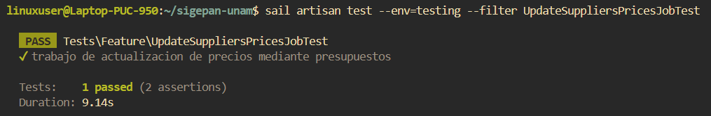

# Documentación de Tests: UpdateSuppliersPricesJobTest

## Información General
- **Archivo**: `/tests/Feature/UpdateSuppliersPricesJobTest.php`
- **Fecha de generación**: 2025-07-28 02:30:49
- **Total de tests**: 1

---

## TC001. - `test_trabajo_de_actualizacion_de_precios_mediante_presupuestos`

### 📋 Propósito del Test
Actualizar precios de proveedores mediante presupuestos obtenidos.

### 🎯 Resultado Esperado
Se ejecuta un job en el sistema que actualiza los precios luego de un periodo presupuestario.

### ⚙️ Configuración del Test
```php
// Método: test_trabajo_de_actualizacion_de_precios_mediante_presupuestos()
// Archivo: /tests/Feature/UpdateSuppliersPricesJobTest.php
// Línea: 206
```

### 📊 Resultado de Ejecución
**Estado**: Ejecutado

### 📝 Observaciones
Ninguna.

---

## Resumen de Ejecución

### Estadísticas
- **Total de tests**: 1
- **Estado general**: Finalizado
- **Última actualización**: 2025-07-28 02:30:49

#### Captura de Pantalla


---

**Documentación generada automáticamente con**: `php artisan test:document`  
**Fecha**: 2025-07-28 02:30:49  
**Versión de Laravel**: 11.22.0  
